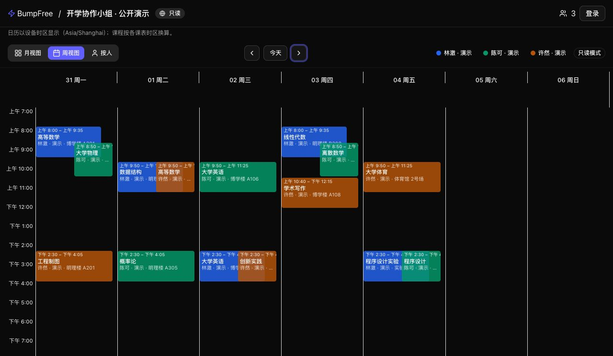
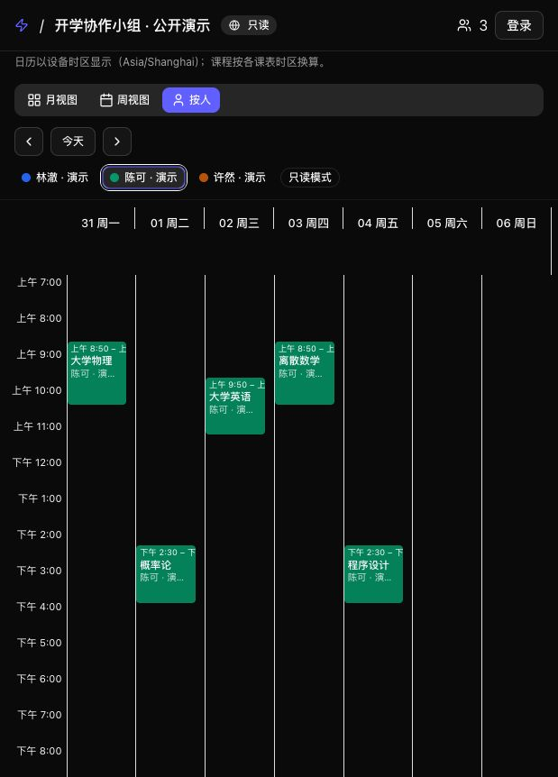

<div align="center">

# BumpFree

### Everyone's timetable. One shared calendar.

Import ICS files and bring your team's courses and busy blocks into one Room.<br />
Shared timetables for student groups, clubs, and project teams—compare calendars before planning together.

<sub>把大家的课表，放在同一张日历上。</sub>

[](https://bumpfree.lucius7.dev/room/?id=59685c90-bea8-4d4f-8212-9378e83c526f)
[](https://github.com/theLucius7/bumpfree/actions/workflows/ci.yml)
[](LICENSE)
[](https://www.typescriptlang.org/)
[](docs/deployment.md)

[Start using BumpFree](https://bumpfree.lucius7.dev) · [View the public demo](https://bumpfree.lucius7.dev/room/?id=59685c90-bea8-4d4f-8212-9378e83c526f) · [Quick start](#a-30-second-quick-start-guide) · [Feedback](https://github.com/theLucius7/bumpfree/issues)

[简体中文](README.md) · **English**

</div>



> Real application screenshots. Explore the [public, read-only Demo Room](https://bumpfree.lucius7.dev/room/?id=59685c90-bea8-4d4f-8212-9378e83c526f) without registering. All people, courses, instructors, and locations are fictional. The demo covers 20 weeks from 2026-08-24; navigate to that range if needed. See [demo details](docs/demo.md). The current interface is primarily in Simplified Chinese.

## Less back-and-forth. More shared context.

Instead of exchanging timetable screenshots, bring your team's courses and one-off busy blocks into a shared **Room**.

**Apps such as [WakeUp课程表](https://www.wakeup.fun/) and [超级课程表](https://www.super.cn/index.php) help you manage your own timetable; BumpFree focuses on comparing multiple ICS timetables and collaborating in a shared Room.** If you already have an ICS file, import it to compare your team's schedules in one calendar.

| Feature                     | What you can do                                                                                              |
| --------------------------- | ------------------------------------------------------------------------------------------------------------ |
| **ICS import with preview** | Check course names, times, instructors, locations, and weeks before saving. No WakeUp sharing code required. |
| **Shared calendars**        | Compare color-coded schedules in week, month, or individual-member views.                                    |
| **Room collaboration**      | Invite registered users by display name. Their active timetable appears after they accept.                   |
| **Multiple timetables**     | Keep different semesters, switch your active timetable, and edit courses manually.                           |
| **One-off busy blocks**     | Add commitments outside your recurring courses.                                                              |
| **Private by default**      | Room owners can optionally enable a public, read-only link.                                                  |

BumpFree visualizes recorded schedules; it does not automatically schedule meetings or confirm someone's availability.

## Screenshots

### Check the import before saving

<!-- TODO: Add a real ICS import-preview screenshot after authorized sign-in. -->

Choose an ICS file, review the semester settings, course times, instructors, and locations, then confirm the import.

Common recurrence rules, alternating weeks, and exceptions are supported. Missing information is not guessed, and unsupported cases are reported. See [import support and limits](docs/usage.md#ics-导入支持范围).

### Focus on one teammate



## A 30-second quick-start guide

1. **Register and save your recovery code**: visit [BumpFree](https://bumpfree.lucius7.dev) and keep the code somewhere safe.
2. **Import your timetable**: open **我的课表** (My timetables), choose an `.ics` file, check the semester settings and course preview, then confirm.
3. **Create a Room**: open **我的 Room** (My Rooms) and invite registered teammates by display name. Their active timetables appear once they accept.
4. **Compare and share**: view courses and busy blocks together. To share with people who have not registered, the Room owner can enable a public, read-only link.

No ICS file yet? [Download the fictional demo timetable](https://raw.githubusercontent.com/theLucius7/bumpfree/main/examples/demo-schedule.ics). Set the first Monday to **2026-08-31** and the duration to **20 weeks**. The current import interface uses **Asia/Shanghai**. Navigate the calendar to the sample dates; this is not your actual timetable.

## Privacy and boundaries

- **No university credentials**: import an ICS file you already have. BumpFree does not ask for your university portal username or password.
- **No persistent storage of raw ICS files**: files are parsed in your browser. After confirmation, structured course data is saved for timetable and Room views; course data is not local-only.
- **Private Rooms by default**: enabling a public link exposes courses, instructors, locations, and **course notes** to anyone with the link. Do not include sensitive information.
- **Keep your recovery code safe**: email addresses are currently unverified login identifiers. There is no verification or password-reset email service; recovery uses recovery codes.

An empty calendar slot does not guarantee availability. Confirm unrecorded commitments with your teammates. Read the [usage and privacy guide](docs/usage.md) for details.

## For developers: run and deploy

**Cloudflare Pages + Workers + D1** serve the static frontend, same-origin API, and persistent data. The current version does not require Vercel or Supabase. It can run within Cloudflare's free allowances; this is not a promise of unlimited capacity or uptime.

<details>
<summary>Local development setup (Node.js 22 + npm)</summary>

First-time setup:

```bash
git clone https://github.com/theLucius7/bumpfree.git
cd bumpfree
npm ci
cp .dev.vars.example worker/.dev.vars
```

Generate an independent local `AUTH_PEPPER` and put it in `worker/.dev.vars`. Set `SITE_URL` and `DEV_ORIGIN` to `http://localhost:3000`:

```bash
node -e 'console.log(require("node:crypto").randomBytes(32).toString("hex"))'
npm run db:local
```

Run `npm run dev:api` and `npm run dev` in separate terminals, then open [localhost:3000](http://localhost:3000). Local development does not require a Cloudflare API Token. Never reuse production secrets locally.

</details>

Before deploying a fork, replace the maintainer's domain, D1 UUID, and project settings. GitHub CI validates changes but **does not automatically deploy production**. Full instructions: [deployment and maintenance](docs/deployment.md).

## Documentation and contributions

Detailed guides are currently in Chinese:

- [Usage, ICS support, and privacy](docs/usage.md)
- [Deployment, free allowances, administrators, and backups](docs/deployment.md)
- [Architecture and project structure](docs/architecture.md)
- [Security boundaries](SECURITY.md)
- [Contributing](CONTRIBUTING.md)
- [Demo, screenshots, and social preview assets](docs/demo.md)

Found a bug or have a use case to share? [Open an issue](https://github.com/theLucius7/bumpfree/issues/new/choose) or send a pull request. If BumpFree helps your team coordinate, a Star helps others discover it.

Thanks to [@zalataraglados-prog](https://github.com/zalataraglados-prog) for contributions to timetable import, course management, busy blocks, Room collaboration, and administrator configuration in [PR #1](https://github.com/theLucius7/bumpfree/pull/1).

## License

Distributed under the [MIT License](LICENSE). Keep the copyright and permission notice when using or distributing the software.
